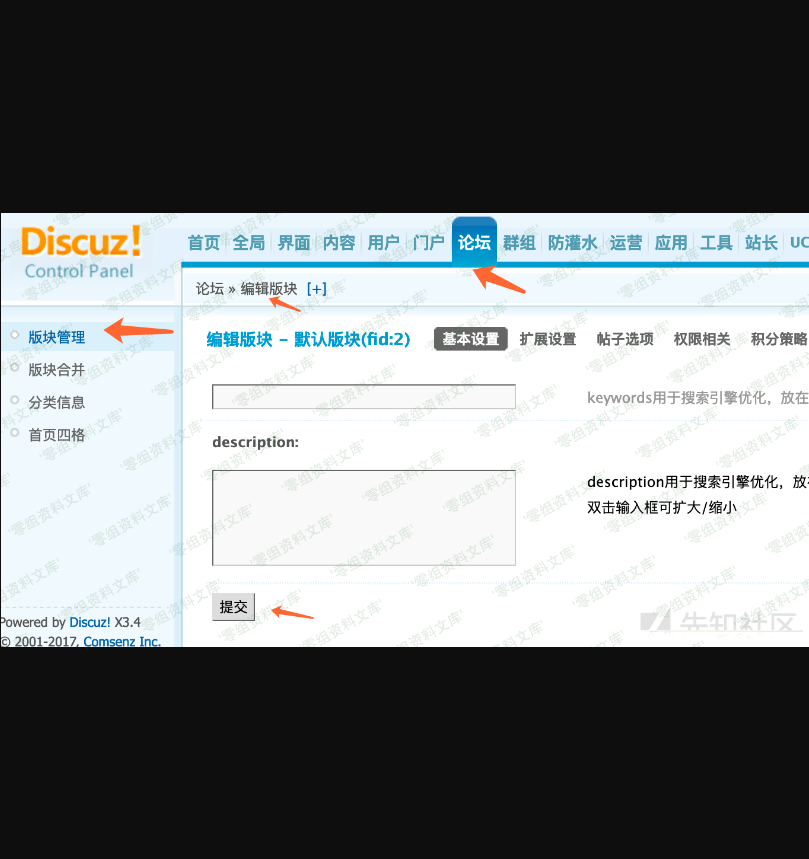
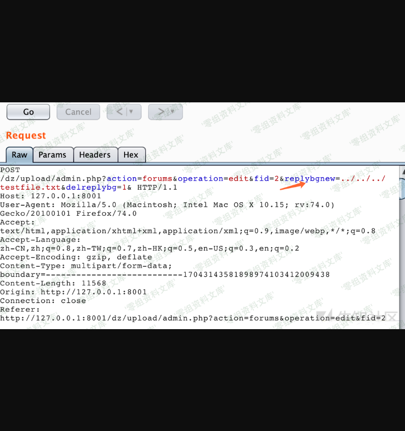
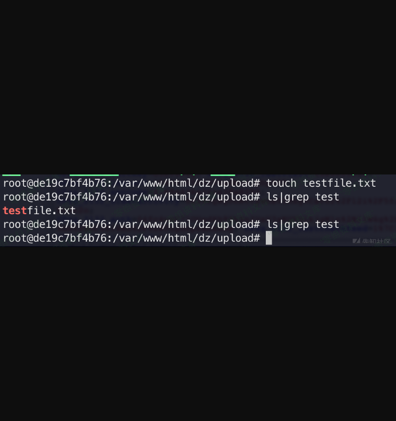

Discuz! X3.4 后台任意文件删除
=============================

一、漏洞简介
------------

后台任意文件删除，需要有管理员的权限。

二、漏洞影响
------------

Discuz!X V3.4

三、复现过程
------------

### 漏洞分析

分析一下该请求的流程。

请求URL：`/dz/upload/admin.php?action=forums&operation=edit&fid=2&replybgnew=../../../testfile.txt&delreplybg=1`

在`admin.php`中接收了action参数，在第58行经过`admincpfile`函数处理后返回文件路径，并包含该文件。

    if($admincp->allow($action, $operation, $do) || $action == 'index') {
            require $admincp->admincpfile($action);

看一下该函数的处理过程：

    function admincpfile($action) {
            return './source/admincp/admincp_'.$action.'.php';
        }

经过处理返回的内容是：`./source/admincp/admincp_forums.php`，也就来到了漏洞存在的地方。

根据if/else的判断条件，进入else中的代码：

    if(!submitcheck('detailsubmit')) {
      ......
    }
    else{

    }

造成漏洞的代码：

    if(!$multiset) {
      if($_GET['delreplybg']) {
        $valueparse = parse_url($_GET['replybgnew']);
        if(!isset($valueparse['host']) && file_exists($_G['setting']['attachurl'].'common/'.$_GET['replybgnew'])) {
          @unlink($_G['setting']['attachurl'].'common/'.$_GET['replybgnew']);
        }
        $_GET['replybgnew'] = '';
      }

`$multiset`默认为0，只要不给该参数赋值就满足条件进入if语句。

第二个if语句，检查GET参数`delreplybg`有没有内容，然后做了下检测，检测parse\_url函数返回的结果中有没有host这个变量，来确保GET参数`replybgnew`不是url，但是并不影响传入文件路径。

这里`$_G['setting']['attachurl'`的值为`data/attachment/`，再拼接上`common/`和`$_GET['replybgnew']`，这样路径就可控了。通过unlink达到文件删除的目的。

### 漏洞复现

登陆后台，进入论坛-\>模块管理-\>编辑板块，使用burp拦截提交的数据。

发送，查看文件发现被删除。

参考链接
--------

> https://xz.aliyun.com/t/7492\#toc-7
