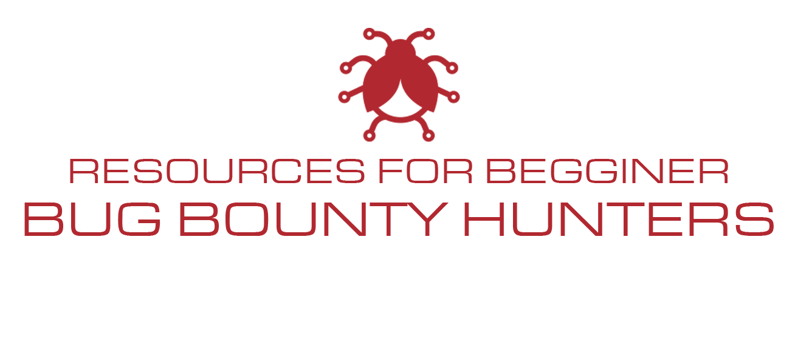

# Resources-for-Beginner-Bug-Bounty-Hunters

## Intro
### Current Version: 2023.01
Welcome to our web hacking and bug bounty hunting resource repository! A curated collection of web hacking tools, tips, and resources is available here. We hope that this repository will be a valuable resource for you as you work to secure the internet and make it a safer place for everyone, whether you're a seasoned bug bounty hunter or just getting started.

We understand that there are more resources other than the ones we have listed and we hope to cover more resources in the near future! 

If you are interested in learning about top bug bounty hunters in the community check out my [Live Recon VODs](https://www.youtube.com/playlist?list=PLKAaMVNxvLmAkqBkzFaOxqs3L66z2n8LA).

## NahamSec's Personal Resource:
I have also put together my own resource:

- [NahamSec's Udemy Course](https://www.udemy.com/course/intro-to-bug-bounty-by-nahamsec/?couponCode=NAHOMIES)
- [NahamSec's Udemy Labs](https://github.com/nahamsec/nahamsec.training)
- [Nahamsec on YouTube](https://www.youtube.com/NahamSec) 
- [Nahamsec on Twitch](https://www.twitch.tv/nahamsec)

---
## Table of Contents

- [Basics](/md/Resources-for-Beginner-Bug-Bounty-Hunters/assets/basics.md)
- [Blog posts & Talks](/md/Resources-for-Beginner-Bug-Bounty-Hunters/assets/blogposts.md)
- [Books](/md/Resources-for-Beginner-Bug-Bounty-Hunters/assets/books.md)
- [Setup](/md/Resources-for-Beginner-Bug-Bounty-Hunters/assets/setup.md)
- [Tools](/md/Resources-for-Beginner-Bug-Bounty-Hunters/assets/tools.md)
- [Labs & Testing Environments](/md/Resources-for-Beginner-Bug-Bounty-Hunters/assets/labs.md)
- [Talks](/md/Resources-for-Beginner-Bug-Bounty-Hunters/assets/talks.md)
- [Vulnerability Types](/md/Resources-for-Beginner-Bug-Bounty-Hunters/assets/vulns.md)
- [Mobile Hacking](/md/Resources-for-Beginner-Bug-Bounty-Hunters/assets/mobile.md)
- [Coding & Scripting](/md/Resources-for-Beginner-Bug-Bounty-Hunters/assets/coding.md)
- [Media Resources](/md/Resources-for-Beginner-Bug-Bounty-Hunters/assets/media.md)
- [Mindset & Mental Health](/md/Resources-for-Beginner-Bug-Bounty-Hunters/assets/health.md)

---
If you have more questions or suggestions, check out [NahamSec's Discord](https://discord.gg/9jZxjQ5)! 

